
This is a re-post from a previous version of The Computer Crowd.


So you are new to Linux and you downloaded PuTTY (or some other client), connected to your server and you have no idea what to do now.

I will go through some of the most used commands and post screen shots of what it will look like. Before we start if you want to know more about a command you can run “command –help” and it will show the man page for the specific command.

This post is not meant to be a catch all for each commands this post is just to give you a general understanding of how to perform common tasks in a BASH session.

# Using cd: Changing Directories:
Changing directories is very simple, and probably the most common task you will preform in a BASH session.

## cd (cd to the user's home directory)
```bash
cd
```
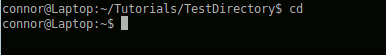

## cd directory (change to a directory relative to where your at)
```bash
cd TestDirectory
```
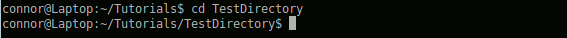

## cd /home/connor/directory (change directory relative to the filesystem)
```bash
cd /home/connor/directory
```
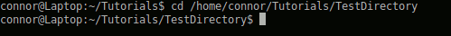

# Using ls: Listing Contents:
Another very common task is listing a directory’s contents.

## ls (list current directory)
```bash
ls
```
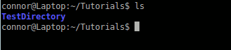

## ls directory (list directory relative to where your at)
```bash
ls Tutorials/TestDirectory/
```
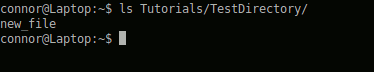

## ls /home/connor/directory (list directory relative to the filesystem)
```bash
ls /home/connor/Tutorials
```
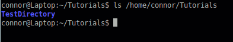

There are options you can add to your “ls” command
```bash
ls -a # (will list all the files in the directory)
ls -la # (will list all the files in the directory in long list format)
```

# Using mkdir: Making Directories:
Okay so you can change directories and list the contents and thats all fine and dandy but what about creating directories? Well yet again this is a simple process.

## mkdir (make directory)
```bash
mkdir TestDirectory
```
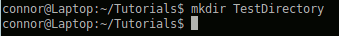


# Using touch: Creating Files:
Now you want to create a file inside that directory.

## touch (create file)
```bash
touch new_file
```
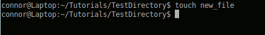


# Using mv:
So you want to rename or move a file or directory?

## mv (move file / directory)
```bash
mv TestDirectory NewTestDirectory
```
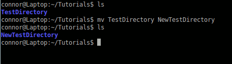


# Using rm:
Now you want to delete or remove a file

Note: This perminantly deletes the file and there is no recycle bin like in Windows!

## rm (remove file)
```bash
rm new_file
```
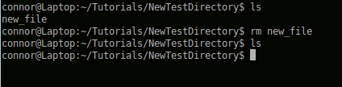


You can not use this method on directories.

## rm -r (remove directory)
```bash
rm -fr NewTestDirectory
```
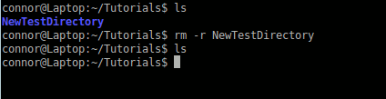

You have to -r the rm command here so that it will recursively remove the contents of the directory.

# Using chmod:
To change file permissions you need to use a chmod command. I suggest you learn more about file permissions by reading this page before you attempt this command.

Note: I never suggest using 0777 I was just using this as an example.

## chmod
```bash
chmod 0777 TestDirectory
```
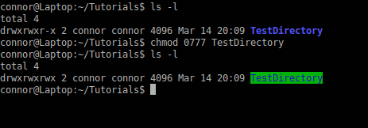


# Using chown:
If you want to change ownership of a file or directory you use use the chown command. To chown a file that doesn’t belong to you, you will need to be root (I don’t suggest) or you need to use sudo.

# chown
```bash
sudo chown root:root TestDirectory
```
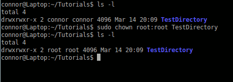

As I stated earlier in this post, this is just a simple overview of some of the most commonly used BASH commands. If you have any questions please comment below or in our forums.